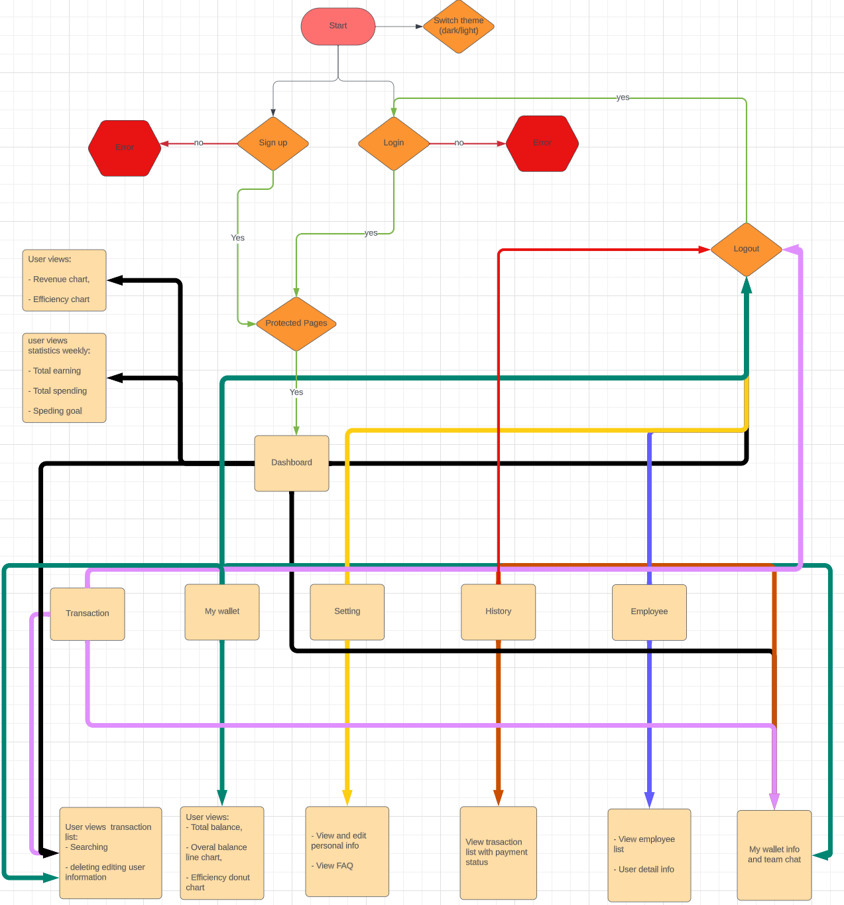

# **REACT PROJECT - ENVATO MARKET**

### Overview:

- This is an internal project which will demonstrate the dashboard like a real system.
- [Design](https://preview.themeforest.net/item/bankco-react-tailwind-admin-templates/full_screen_preview/47639153)

### Timeline:

- Estimate time: 4 weeks.

## TECH STACKS:

### Libraries:

- [React](https://react.dev/learn): is a JavaScript library for building user interfaces.
- [React Query](https://tanstack.com/query/latest/): Powerful asynchronous state management for TS/JS, React.
- [Zustand](https://github.com/pmndrs/zustand):A small, fast, and scalable bearbones state management solution. Zustand has a comfy API based on hooks. It isn't boilerplatey or opinionated, but has enough convention to be explicit and flux-like.
- [React Hook Form](https://react-hook-form.com/): React Hook Form reduces the amount of code you need to write while removing unnecessary re-renders.
- [Chakra](https://chakra-ui.com/): Chakra UI is a simple, modular and accessible component library that gives you the building blocks you need to build your React applications.
- [Apex Chart](https://apexcharts.com/react-chart-demos/column-charts/basic/): ApexCharts is a modern charting library that helps developers to create beautiful and interactive visualizations for web pages.
- [React Router](https://v5.reactrouter.com/web/guides/quick-start): is a standard library for routing in React.
- [Storybook](https://storybook.js.org/): captures the rendered state of a UI component. Developers write multiple stories per component that describe all the “interesting” states a component can support.
- Editor: Visual Studio Code.

### Testing

- [React Testing Library](https://testing-library.com/): Simple and complete testing utilities that encourage good testing practices. Is a light-weight solution for testing web pages by querying and interacting with DOM nodes.

### Debug tool

- [React Developer Tools](https://chrome.google.com/webstore/detail/react-developer-tools/fmkadmapgofadopljbjfkapdkoienihi) React Developer Tools is a Chrome DevTools extension for the open-source React JavaScript library. It allows you to inspect the React component hierarchies in the Chrome Developer Tools.
- [Responsively App](https://responsively.app/): A simple application for developing, help dev test design in many screens.

### Hosting

- Open http://localhost:3000 to view it in the browser.

### CI/CD, Deployment, Hosting

- Vercel
- Firebase

### Document:

- [Requirements and plan](https://docs.google.com/document/d/1ldS_HWBGAXGrlWht7vxZAVjFcJo5wu8SajiaIf1_xR8/edit)

### Flow App

### Task Management

- [Trello](https://trello.com/b/xo8WyIM1/envato-market-system)

## Getting started

Build and Run app:

| Command                                                                     | Action                        |
| :-------------------------------------------------------------------------- | :---------------------------- |
| `$ git clone https://gitlab.asoft-python.com/kien.nguyen/envato-market.git` | Clone Repository with HTTPS   |
| `$ git clone git@gitlab.asoft-python.com:kien.nguyen/envato-market.git`     | Clone Repository with SSH     |
| `$ cd envato-market`                                                        | Redirect to folder            |
| `$ git checkout develop`                                                    | Checkout branch               |
| `$ npm i pnpm`                                                              | Install packages pnpm         |
| `$ pnpm install`                                                            | Install packages dependencies |
| `$ pnpm run build`                                                          | Run build app                 |
| `$ pnpm run storybook`                                                      | Run Storybook                 |
| `$ pnpm test`                                                               | Run Unit Test                 |
| `$ pnpm dev`                                                                | Run webpage                   |

### Prerequisites:

- Node: version 18.17.1
- pnpm: version 8.10.5
- Vite: version 5.0.0
